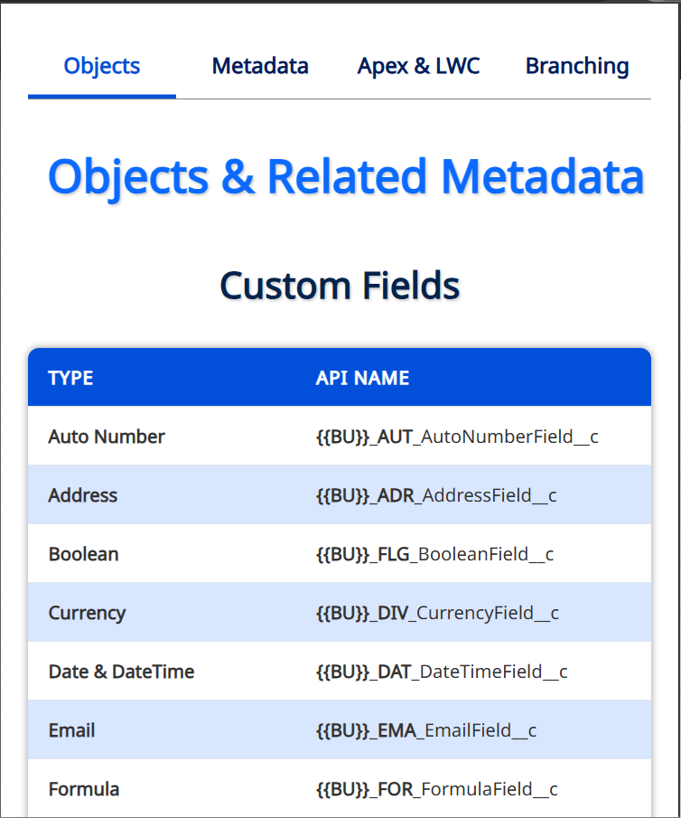
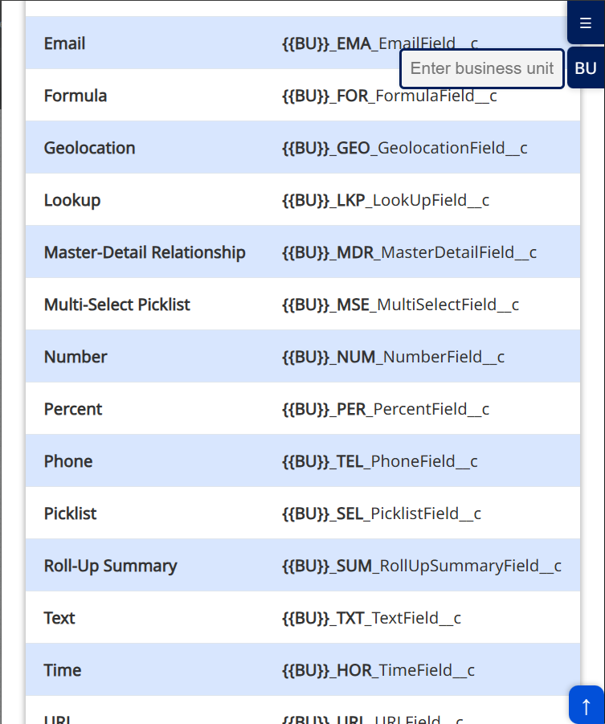
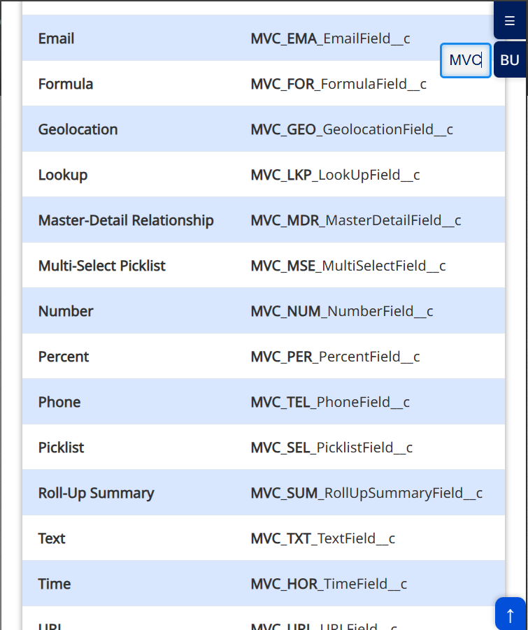
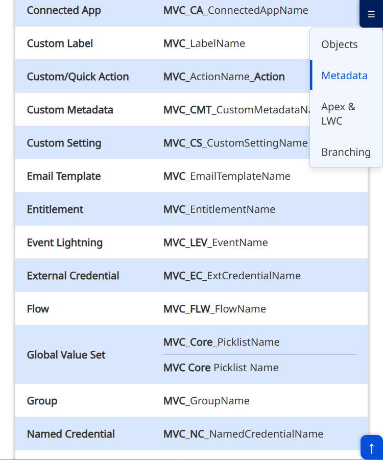

#  SF Best Practices Browser Extension

> [!IMPORTANT]  
> A browser extension designed to help Salesforce developers and teams follow best practices and naming conventions. Organized into intuitive tabs, this tool provides quick access to guidelines, examples, and strategies for maintaining high-quality and maintainable Salesforce projects.


## ✨ Features

- **📦 Objects & Related Metadata**  
  Naming conventions and best practices for Salesforce objects, fields, relationships, and related metadata.

- **📄 Metadata**  
  Guidelines for naming and organizing custom metadata types, labels, and other metadata components.

- **⚙️ Apex & LWC**  
  Best practices for writing Apex classes, triggers, and Lightning Web Components (LWC), including naming conventions and code examples.

- **🌿 Branching Strategies**  
  Recommended branching strategies for version control in Salesforce projects, including Git workflows and deployment tips.


## 🚀 Installation

1. Clone this repository or download the extension files.
2. Open your browser's extension management page:
   - Chrome: `chrome://extensions/`
   - Edge: `edge://extensions/`
3. Enable **Developer mode**.
4. Click **Load unpacked** and select the extension folder.
5. The extension will appear in your browser's toolbar.

## 🛠️ Usage

- Click the extension icon in your browser's toolbar to open the popup.
- Navigate through the tabs to access the relevant best practices and naming conventions.
- Use the examples and guidelines to improve your Salesforce development workflow.

## 📸 Screenshots

| **Main** | **Tab** | **Business** | **Business Text** | **Menu** |
|----------|---------|--------------|-------------------|----------|
|  |  |  |  |  |

## 🤝 Contributing

We welcome contributions! If you have suggestions for additional best practices, naming conventions, or improvements, please:

1. Fork the repository.
2. Create a new branch:

    ```bash
    git checkout -b feature/YourFeatureName
    ```

3. Commit your changes:

    ```bash
    git commit -m 'Add some feature'
    ```

4. Push to the branch:

    ```bash
    git push origin feature/YourFeatureName
    ```

5. Open a pull request.

## 📜 License

This project is licensed under the MIT License. See the [LICENSE](LICENSE) file for details.

## 📞 Contact

For questions or feedback, feel free to:

- Open an issue in this repository.
- Contact the maintainers directly.

---

### 🎉 Thank you for using SF Best Practices Browser Extension! 🎉